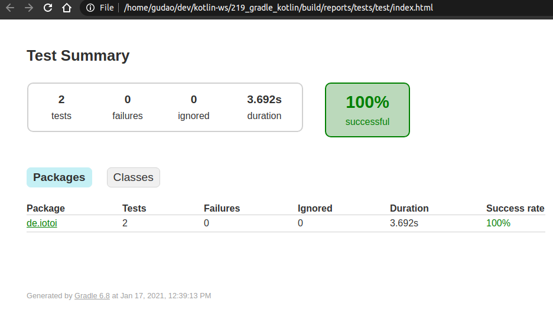

<a href = "https://kotlinlang.org/">

</a>


[](https://ubuntu.com/)
[](https://github.com/shyiko/jabba)
[](https://gradle.org/)
[](https://www.azul.com/downloads/zulu-community/?package=jdk)
[](https://github.com/JetBrains/kotlin)
[](https://www.jetbrains.com/idea/download/#section=linux)
[](https://www.docker.com/)
[](https://app.circleci.com/pipelines/github/cnruby/gradle_kotlin?branch=basic_219)


---

Unit 219: Hello @Order!
<h1>Unit 219: Hello @Order!</h1>

- How to Understand The Annotation @Order!


---


<h1>Table of Contents</h1>


- [Keywords](#keywords)
- [Prerequisites](#prerequisites)
- [Create A New Kotlin Web App](#create-a-new-kotlin-web-app)
  - [DO (create a new project)](#do-create-a-new-project)
  - [DO (check the project)](#do-check-the-project)
- [Develop REST Assured Testing about the Annotation @Order](#develop-rest-assured-testing-about-the-annotation-order)
  - [DO (add a new book testing file with the annotation @Order)](#do-add-a-new-book-testing-file-with-the-annotation-order)
  - [DO (start the web app)](#do-start-the-web-app)
  - [DO (run the testing in the project with gradle)](#do-run-the-testing-in-the-project-with-gradle)
  - [DO (see the testing report)](#do-see-the-testing-report)
- [References](#references)
- [References for tools](#references-for-tools)


## Keywords
- Annotation `@Order` `Rest Assured` `Web Application` REST API Testing
- `Java JDK` `Command Line Kotlin Compiler` `IntelliJ CE` CircleCI CI
- tutorial example Kotlin REPL Ubuntu Gradle jabba JDK Java JVM
- database h2 Console `Spring Boot` `Spring DataSource` JPA Hibernate Classpath h2


## Prerequisites
- [install JDK on Ubuntu 20.04](https://github.com/cnruby/gradle_java/blob/basic_101/README.md)
- [install Gradle on Ubuntu 20.04](https://github.com/cnruby/gradle_java/blob/basic_102/README.md)
- [IntelliJ IDEA Community](https://www.jetbrains.com/de-de/idea/download/#section=linux)
- [install Docker on Ubuntu](https://docs.docker.com/engine/install/ubuntu/) OR [Using Docker](https://github.com/cnruby/gradle_java/tree/basic_002)
- [CircleCI Account](https://circleci.com/vcs-authorize/)


## Create A New Kotlin Web App

### DO (create a new project)
```bash
EXISTING_APP_ID=218 && NEW_APP_ID=219 && \
git clone -b basic_${EXISTING_APP_ID} https://github.com/cnruby/gradle_kotlin.git ${NEW_APP_ID}_gradle_kotlin && \
cd ${NEW_APP_ID}_gradle_kotlin
```

### DO (check the project)
```bash
./gradlew -q clean check
```
```bash
    # >> Result:nothing
```


## Develop REST Assured Testing about the Annotation @Order

### DO (add a new book testing file with the annotation @Order)
```bash
touch ./src/test/kotlin/de/iotoi/RestAssuredOrderTests.kt
```
```bash
nano ./src/test/kotlin/de/iotoi/RestAssuredOrderTests.kt
```
```kotlin
// FILE (RestAssuredOrderTests.kt)
package de.iotoi

import de.iotoi.model.Book
import io.restassured.RestAssured
import org.apache.commons.lang3.RandomStringUtils
import org.assertj.core.api.Assertions
import org.junit.jupiter.api.AfterAll
import org.junit.jupiter.api.MethodOrderer.OrderAnnotation
import org.junit.jupiter.api.Order
import org.junit.jupiter.api.Test
import org.junit.jupiter.api.TestMethodOrder
import org.springframework.http.HttpStatus
import org.springframework.http.MediaType

@TestMethodOrder(OrderAnnotation::class)
class RestAssuredOrderTests {
  private fun createRandomBook(): Book {
    val book = Book()
    book.title = RandomStringUtils.randomAlphabetic(10)
    book.author = RandomStringUtils.randomAlphabetic(15)
    return book
  }

  @Test
  @Order(1)
  fun firstTest() {
    val response = RestAssured.get(API_ROOT)
    Assertions.assertThat(HttpStatus.OK.value()).isEqualTo(response.statusCode)

    output.append("get;")
  }

  @Test
  @Order(2)
  fun secondTest() {
    val book = createRandomBook()
    val response = RestAssured.given()
      .contentType(MediaType.APPLICATION_JSON_VALUE)
      .body(book)
      .post(API_ROOT)
    Assertions.assertThat(HttpStatus.CREATED.value()).isEqualTo(response.statusCode)

    output.append("create;")
  }

  companion object {
    private const val API_ROOT = "http://localhost:8080/api/books"
    private val output = StringBuilder("")
    @AfterAll
    fun assertOutput() {
      Assertions.assertThat(output.toString()).isEqualTo("get;create;")
    }
  }
}
```

### DO (start the web app)
```bash
./gradlew -q bootRun
```
```bash
    # >> Result
    <==========---> 83% EXECUTING [10s]
    > :bootRun
```

### DO (run the testing in the project with gradle)
```bash
./gradlew -q clean test --tests de.iotoi.RestAssuredOrderTests
```
```bash
    # >> Result: nothing
```

### DO (see the testing report)
```bash
google-chrome ./build/reports/tests/test/index.html
```



## References
- https://rest-assured.io/
- https://github.com/rest-assured/rest-assured/wiki/GettingStarted
- https://medium.com/@nieldw/exclude-a-transitive-dependency-with-gradles-kotlin-dsl-82fb41da67f
- https://github.com/kucharzyk/spring-kotlin-angular4/blob/master/build.gradle.kts
- https://docs.gradle.org/current/userguide/building_java_projects.html
- https://stackoverflow.com/questions/53790182/get-the-current-value-of-illegal-access-setting-in-java
- https://www.gitmemory.com/issue/spring-projects/spring-boot/22303/656792408
- https://backstage.forgerock.com/knowledge/kb/article/a15048811
- https://github.com/gradle/gradle/releases
- https://www.xspdf.com/resolution/58300460.html
- https://www.xspdf.com/resolution/52404548.html
- https://docs.microsoft.com/en-us/azure/developer/java/fundamentals/transition-from-java-8-to-java-11


## References for tools
- [Add a copy to clipboard button in a GitHub](https://github.com/zenorocha/codecopy#install)
