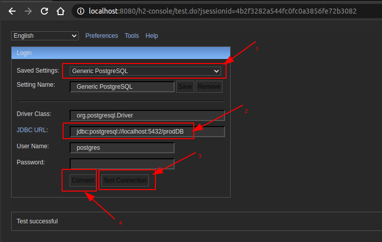
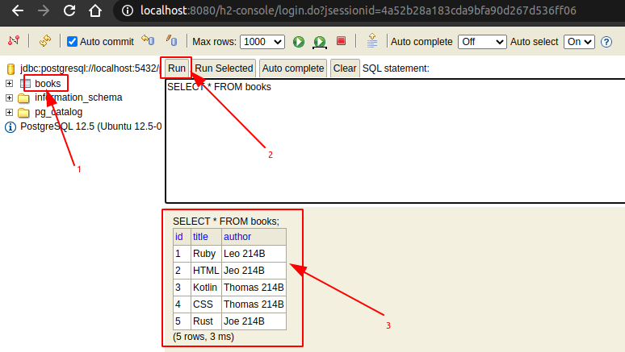

<a href = "https://kotlinlang.org/">

</a>


[](https://ubuntu.com/)
[](https://github.com/shyiko/jabba)
[](https://gradle.org/)
[](https://www.azul.com/downloads/zulu-community/?package=jdk)
[](https://github.com/JetBrains/kotlin)
[](https://www.jetbrains.com/idea/download/#section=linux)
[](https://www.docker.com/)
[](https://app.circleci.com/pipelines/github/cnruby/gradle_kotlin?branch=basic_214)


---

Unit 214: Hello PostgreSQL with DataSource!
<h1>Unit 214: Hello PostgreSQL with DataSource!</h1>

- How to Understand The Database PostgreSQL with Spring DataSource

---


<h1>Table of Contents</h1>


- [Keywords](#keywords)
- [Prerequisites](#prerequisites)
- [Create A New Kotlin Web App](#create-a-new-kotlin-web-app)
  - [DO (create a new project)](#do-create-a-new-project)
  - [DO (check the project)](#do-check-the-project)
- [Develop The Spring Web Application with PostgreSQL](#develop-the-spring-web-application-with-postgresql)
  - [DO (edit the gradle build file for spring)](#do-edit-the-gradle-build-file-for-spring)
  - [DO (create a new database with a name `prodDB` for a user `gudao`)](#do-create-a-new-database-with-a-name-proddb-for-a-user-gudao)
  - [DO (edit the application properties file for spring)](#do-edit-the-application-properties-file-for-spring)
  - [DO (edit a schema file for datasource)](#do-edit-a-schema-file-for-datasource)
  - [DO (edit a data file for datasource)](#do-edit-a-data-file-for-datasource)
  - [DO (edit a kotlin file for spring boot)](#do-edit-a-kotlin-file-for-spring-boot)
  - [DO (check the project)](#do-check-the-project-1)
- [Run the Spring Web Application with PostgreSQL](#run-the-spring-web-application-with-postgresql)
  - [DO (run the web application with gradle)](#do-run-the-web-application-with-gradle)
  - [DO (access the web application api)](#do-access-the-web-application-api)
  - [DO (add a new record for the web application api)](#do-add-a-new-record-for-the-web-application-api)
  - [DO (access the web application api)](#do-access-the-web-application-api-1)
  - [DO (browse the h2 Console)](#do-browse-the-h2-console)
  - [DO (stop the web server)](#do-stop-the-web-server)
  - [DO (delete PostgreSQL database)](#do-delete-postgresql-database)
- [References](#references)
- [References for tools](#references-for-tools)


## Keywords
- PostgreSQL `Spring DataSource` `Web Application` database
- `Java JDK` `Command Line Kotlin Compiler` `IntelliJ CE` CircleCI CI
- tutorial example Kotlin REPL Ubuntu Gradle jabba JDK Java JVM
- h2 Console `Spring Boot` REST API h2 JPA Hibernate Classpath


## Prerequisites
- [install JDK on Ubuntu 20.04](https://github.com/cnruby/gradle_java/blob/basic_101/README.md)
- [install Gradle on Ubuntu 20.04](https://github.com/cnruby/gradle_java/blob/basic_102/README.md)
- [IntelliJ IDEA Community](https://www.jetbrains.com/de-de/idea/download/#section=linux)
- [install Docker on Ubuntu](https://docs.docker.com/engine/install/ubuntu/) OR [Using Docker](https://github.com/cnruby/gradle_java/tree/basic_002)
- [CircleCI Account](https://circleci.com/vcs-authorize/)
- [install Database postgreSQL](https://github.com/cnruby/gradle_kotlin/tree/basic_001)


## Create A New Kotlin Web App

### DO (create a new project)
```bash
EXISTING_APP_ID=213 && NEW_APP_ID=214 && \
git clone -b basic_${EXISTING_APP_ID} https://github.com/cnruby/gradle_kotlin.git ${NEW_APP_ID}_gradle_kotlin && \
cd ${NEW_APP_ID}_gradle_kotlin
```

### DO (check the project)
```bash
./gradlew -q check
```
```bash
    # >> Result: nothing
```


## Develop The Spring Web Application with PostgreSQL

### DO (edit the gradle build file for spring)
```bash
nano ./build.gradle.kts
```
```bash
    # FILE (build.gradle.kts)
    ...
	runtimeOnly("com.h2database:h2")
	runtimeOnly("org.postgresql:postgresql")
    ...
```

### DO (create a new database with a name `prodDB` for a user `gudao`)
```bash
sudo -u postgres createdb prodDB -O gudao
```

### DO (edit the application properties file for spring)
```bash
nano ./src/main/resources/application.properties
```
```bash
# FILE (application.properties)
...
# DATASOURCE (DataSourceAutoConfiguration & DataSourceProperties)
spring.datasource.driver-class-name=org.postgresql.Driver
spring.datasource.username=postgres
spring.datasource.password=s$cret
spring.datasource.url = jdbc:postgresql://localhost:5432/prodDB

spring.datasource.initialization-mode=always

# JPA (JpaBaseConfiguration)
spring.jpa.show-sql = true
spring.jpa.open-in-view = true
spring.jpa.properties.hibernate.jdbc.lob.non_contextual_creation=true
...
```

### DO (edit a schema file for datasource)
```bash
nano ./src/main/resources/schema.sql
```
```sql
-- FILE (schema.sql)
DROP TABLE IF EXISTS books;

DROP SEQUENCE IF EXISTS native;
CREATE SEQUENCE native START 5;

CREATE TABLE books (
  id serial PRIMARY KEY,
  title VARCHAR(250) NOT NULL,
  author VARCHAR(250)
);

INSERT INTO books(title, author) VALUES ('Ruby', 'Leo 214B');
INSERT INTO books(title, author) VALUES ('HTML', 'Jeo 214B');
```

### DO (edit a data file for datasource)
```bash
nano ./src/main/resources/data.sql
```
```sql
-- FILE (data.sql)
INSERT INTO books(title, author) VALUES ('Kotlin', 'Thomas 214B');
INSERT INTO books(title, author) VALUES ('CSS', 'Thomas 214B');
```

### DO (edit a kotlin file for spring boot)
```bash
nano ./src/main/kotlin/de/iotoi/model/Book.kt
```
```kotlin
// FILE (Book.kt)
...
@Entity
@Table(name="books")
class Book {
    @Id
    @GeneratedValue(
        strategy= GenerationType.SEQUENCE,
        generator="native"
    )
...
```

### DO (check the project)
```bash
./gradlew -q check
```
```bash
    # >> Result: nothing
```


## Run the Spring Web Application with PostgreSQL

### DO (run the web application with gradle)
```bash
./gradlew -q bootRun
```
```bash
    # >> Result
    <==========---> 83% EXECUTING [35s]
    > :bootRun   
```

### DO (access the web application api)
```bash
curl --no-progress-meter http://localhost:8080/api/books | json_pp
```
```bash
    # >> Result
    [
        {
            "author" : "Leo 214B",
            "id" : 1,
            "title" : "Ruby"
        },
        {
            "author" : "Jeo 214B",
            "id" : 2,
            "title" : "HTML"
        },
        {
            "author" : "Thomas 214B",
            "id" : 3,
            "title" : "Kotlin"
        },
        {
            "author" : "Thomas 214B",
            "id" : 4,
            "title" : "CSS"
        }
    ]
```

### DO (add a new record for the web application api)
```bash
curl --no-progress-meter \
    -H "Content-Type: application/json" \
    -X POST -d '{"title":"Rust","author":"Joe 214B"}' \
    localhost:8080/api/books | json_pp
```
```bash
    # >> Result
    {
        "author" : "Joe 214B",
        "id" : 5,
        "title" : "Rust"
    }
```

### DO (access the web application api)
```bash
curl --no-progress-meter http://localhost:8080/api/books | json_pp
```
```bash
    # >> Result
    [
        {
            "author" : "Leo 214B",
            "id" : 1,
            "title" : "Ruby"
        },
        {
            "author" : "Jeo 214B",
            "id" : 2,
            "title" : "HTML"
        },
        {
            "author" : "Thomas 214B",
            "id" : 3,
            "title" : "Kotlin"
        },
        {
            "author" : "Thomas 214B",
            "id" : 4,
            "title" : "CSS"
        },
        {
            "author" : "Joe 214B",
            "id" : 5,
            "title" : "Rust"
        }
    ]
```

### DO (browse the h2 Console)
```bash
google-chrome http://localhost:8080/h2-console/
```




### DO (stop the web server)
```bash
# DO (Ctrl+C)
```

### DO (delete PostgreSQL database)
```bash
sudo -u postgres dropdb prodDB
```


## References
- https://www.baeldung.com/kotlin/kotlin-jpa
- https://gist.github.com/memory-lovers/4132241df38456642ad888634caee5c6
- https://github.com/DeadLion/spring-boot-samples/blob/master/application.properties.md
- https://dzone.com/articles/run-the-rest-version-of-spring-petclinic-with-angu
- https://dimitr.im/loading-initial-data-with-spring
- https://docs.spring.io/spring-boot/docs/1.2.0.M1/reference/html/howto-database-initialization.html
- https://www.baeldung.com/spring-boot-data-sql-and-schema-sql
- https://stackoverflow.com/questions/38040572/spring-boot-loading-initial-data
- https://docs.microsoft.com/de-de/azure/developer/java/spring-framework/configure-spring-data-jpa-with-azure-mysql
- https://www.xspdf.com/resolution/20463098.html
- https://docs.spring.io/spring-boot/docs/current/reference/html/appendix-application-properties.html
- https://javabydeveloper.com/spring-boot-loading-initial-data/
- https://stackoverflow.com/questions/53464632/application-properties-to-application-yml-spring-boot
- https://github.com/cesarsicas/spring-blog
- https://github.com/spring-projects/spring-boot/issues/20920
- https://stackoverflow.com/questions/53922279/what-are-the-possible-values-of-spring-datasource-initialization-mode
- https://medium.com/@matheus.mfgarcia/kotlin-api-spring-boot-postgresql-d402b4148681
- https://medium.com/@omeryazir/create-a-spring-boot-application-postgresql-spring-security-499488c30beb
- https://docs.spring.io/spring-boot/docs/2.1.0.M1/reference/html/howto-database-initialization.html


## References for tools
- [Add a copy to clipboard button in a GitHub](https://github.com/zenorocha/codecopy#install)
