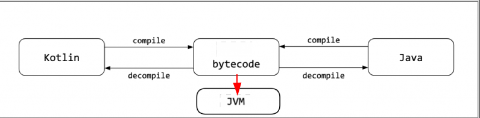
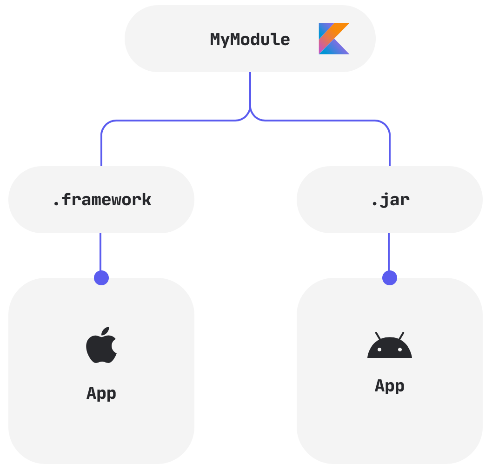

---

Hello "gradle_kotlin"!
<h1>Learn Kotlin with Gradle From null to ONE</h1>

---

<h1>Table of Contents</h1>

- [Keywords](#keywords)
- [Prerequisites](#prerequisites)
- [Kotlin and Java Language](#kotlin-and-java-language)
- [iOS and Android OS](#ios-and-android-os)
- [Kotlin Language](#kotlin-language)
- [References](#references)
- [References for comment](#references-for-comment)
- [References for tutorials](#references-for-tutorials)
- [Other References](#other-references)

## Keywords
- install Kotlin REPL Ubuntu Gradle jabba JDK Java JVM
- `Java JDK` `Command Line Kotlin Compiler` `IntelliJ CE` CircleCI CI
- tutorial example

## Prerequisites
- [install JDK on Ubuntu 20.04](https://github.com/cnruby/gradle_java/blob/basic_101/README.md)
- [install Gradle on Ubuntu 20.04](https://github.com/cnruby/gradle_java/blob/basic_102/README.md)
- install `git`, `wget` and `curl` on Ubuntu 20.04
- install [jabba](https://github.com/shyiko/jabba) and Java JDK [Hello jabba!](https://github.com/cnruby/gradle_java/tree/basic_101)
- [install Command Line Kotlin Compiler (REPL)](https://kotlinlang.org/docs/tutorials/command-line.html) 
- [install IntelliJ CE / IntelliJ IDEA Community Edition](https://www.jetbrains.com/idea/download/#section=linux)

## Kotlin and Java Language

## iOS and Android OS

## Kotlin Language
- Kotlin is an object-oriented language, but it also includes support for function-oriented programming, which has become popular in recent years.
- Every Kotlin type is an object, including Kotlin’s primitive types. 
- (almost) everything has a value

## References
- https://kotlinlang.org/docs/reference
- https://play.kotlinlang.org/
- https://github.com/gradle/kotlin-dsl-samples
- https://gradle-initializr.cleverapps.io/
- https://start.spring.io/
- https://github.com/bmuschko/gradle-initializr
- https://try.kotlinlang.org/

  
## References for comment
- https://www.golem.de/news/kotlin-das-bessere-java-2011-151892.html
- https://cloud.tencent.com/developer/article/1684095
- http://www.1024sky.cn/blog/article/3632
- https://juejin.cn/post/6864946688067371022
- https://mp.weixin.qq.com/s/mWPJiefaNpK8EuoJYvhbhg
- https://blog.jetbrains.com/zh-hans/2020/01/14/kotlin-1-4/
- https://tech.sina.com.cn/roll/2020-04-26/doc-iirczymi8419844.shtml
- https://www.cnbeta.com/articles/tech/1006715.htm
  
## References for tutorials
- https://developer.android.com/kotlin/learn?hl=zh-cn
- https://developer.ibm.com/series/learn-kotlin/
- https://code.tutsplus.com/series/kotlin-from-scratch--cms-1209
- https://www.cnblogs.com/Jetictors/p/9227498.html
- https://www.kotlincn.net/docs/tutorials/
- https://developer.android.com/courses/kotlin-android-fundamentals/overview
- https://developer.android.com/courses/kotlin-android-advanced/overview
- https://www.udacity.com/course/developing-android-apps-with-kotlin--ud9012
- https://mkyong.com/spring-boot/

## Other References
- https://developer.android.com/courses/kotlin-bootcamp/overview
- https://play.kotlinlang.org/koans/overview
- https://kotlinlang.org/docs/tutorials/command-line.html
- https://circleci.com/docs/2.0/env-vars/
- https://linuxconfig.org/install-and-set-up-kvm-on-ubuntu-20-04-focal-fossa-linux
- https://radiochemical.hatenablog.com/archive/category/Spring%20Boot
- https://juejin.cn/post/6844903879834861582
- 