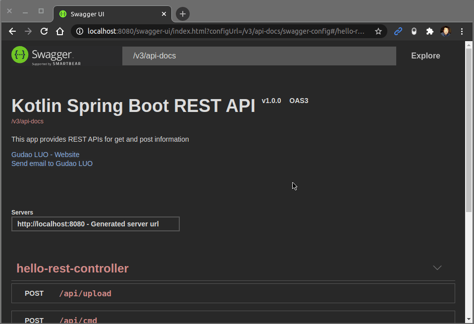
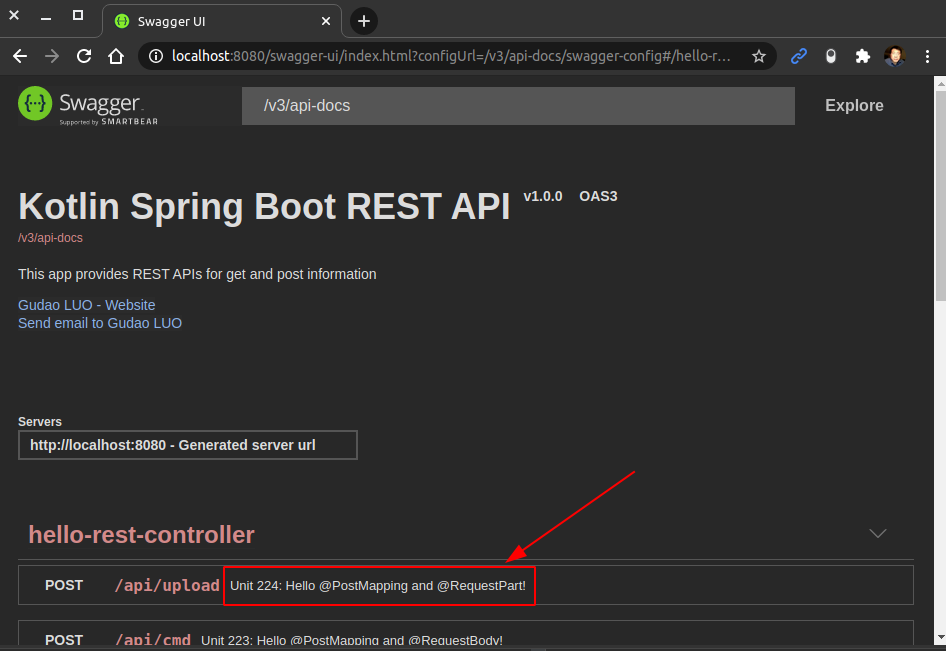
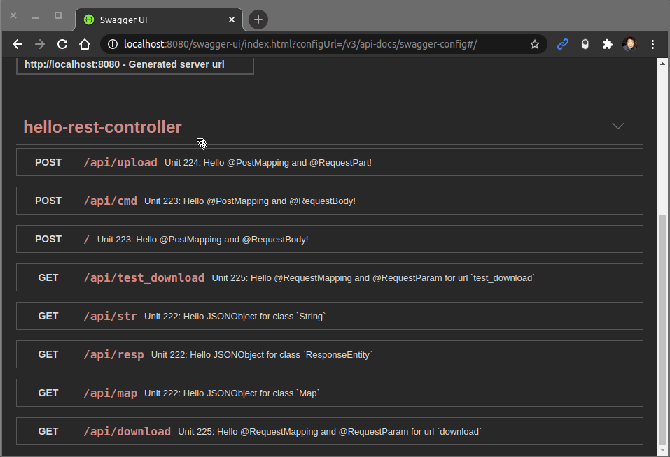
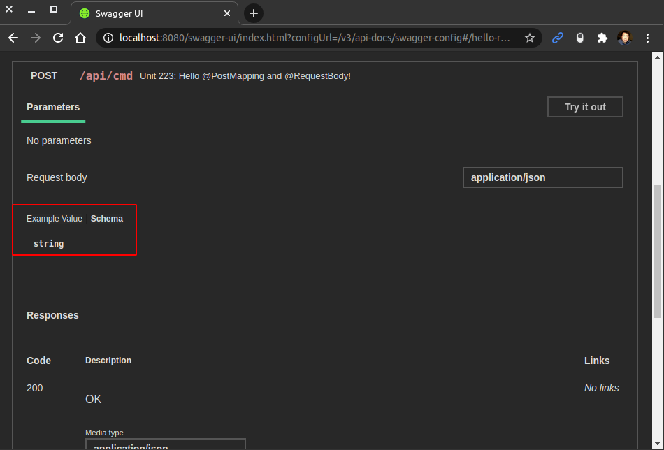
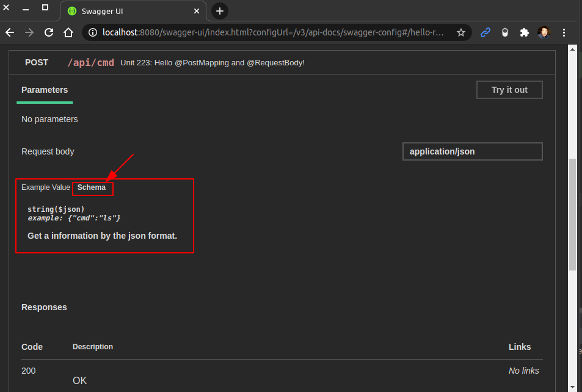
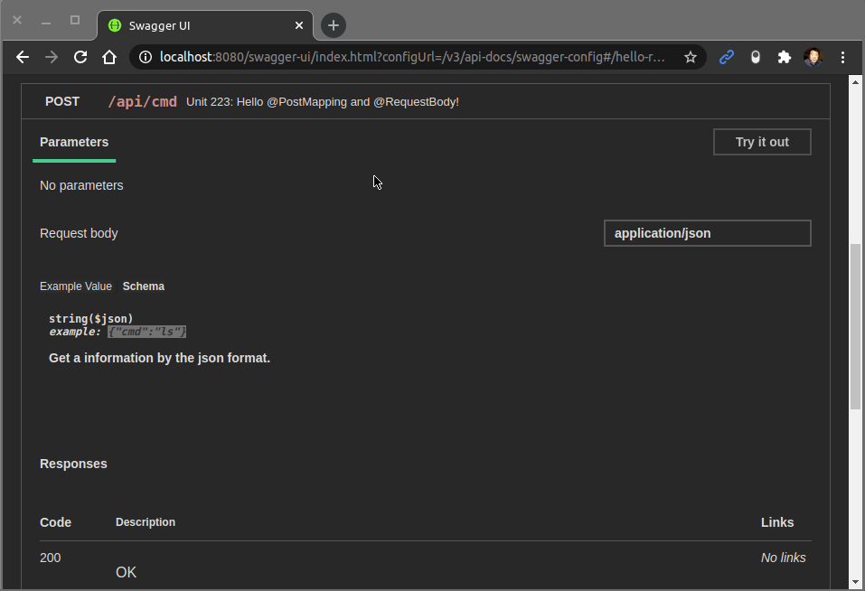

<a href = "https://kotlinlang.org/">

</a>


[](https://ubuntu.com/)
[](https://github.com/shyiko/jabba)
[](https://gradle.org/)
[](https://www.azul.com/downloads/zulu-community/?package=jdk)
[](https://github.com/JetBrains/kotlin)
[](https://www.jetbrains.com/idea/download/#section=linux)
[](https://www.docker.com/)
[](https://app.circleci.com/pipelines/github/cnruby/gradle_kotlin?branch=basic_226)


---

Unit 226: Hello OpenAPI!
<h1>Unit 226: Hello OpenAPI!</h1>

- How to Understand the Java Document `OpenAPI`

---


<h1>Table of Contents</h1>

- [Keywords](#keywords)
- [Prerequisites](#prerequisites)
- [Create A New Kotlin Web App](#create-a-new-kotlin-web-app)
  - [DO (create a new project)](#do-create-a-new-project)
  - [DO (edit the spring property file)](#do-edit-the-spring-property-file)
  - [DO (check the project)](#do-check-the-project)
- [Configure the Project for `OpenAPI`](#configure-the-project-for-openapi)
  - [DO (add the `OpenAPI` to gradle build file)](#do-add-the-openapi-to-gradle-build-file)
  - [DO (add a new kotlin class file for `OpenAPI`)](#do-add-a-new-kotlin-class-file-for-openapi)
  - [DO (check the project)](#do-check-the-project-1)
- [Use the `OpenAPI` for the Project](#use-the-openapi-for-the-project)
  - [DO (run the web application with gradle)](#do-run-the-web-application-with-gradle)
  - [DO (access the web openapi)](#do-access-the-web-openapi)
  - [DO (view the result)](#do-view-the-result)
  - [DO (view the video for url `/api/str`)](#do-view-the-video-for-url-apistr)
  - [DO (stop the web application with gradle)](#do-stop-the-web-application-with-gradle)
- [Add the OpenAPI's Annotation @Operation for the Project](#add-the-openapis-annotation-operation-for-the-project)
  - [DO (edit the kotlin rest controller file)](#do-edit-the-kotlin-rest-controller-file)
  - [DO (run the web application with gradle)](#do-run-the-web-application-with-gradle-1)
  - [DO (access the web openapi)](#do-access-the-web-openapi-1)
  - [DO (view the result for @Operation)](#do-view-the-result-for-operation)
  - [DO (view the video for url `/api/download`)](#do-view-the-video-for-url-apidownload)
  - [DO (stop the web application with gradle)](#do-stop-the-web-application-with-gradle-1)
- [Add the OpenAPI's Annotation @Schema for the Project](#add-the-openapis-annotation-schema-for-the-project)
  - [DO (before add the annotation @Schema)](#do-before-add-the-annotation-schema)
  - [DO (edit the kotlin rest controller file)](#do-edit-the-kotlin-rest-controller-file-1)
  - [DO (access the web openapi)](#do-access-the-web-openapi-2)
  - [DO (after add the annotation @Schema)](#do-after-add-the-annotation-schema)
  - [DO (view the video for url `/api/cmd`)](#do-view-the-video-for-url-apicmd)
  - [DO (stop the web application with gradle)](#do-stop-the-web-application-with-gradle-2)
- [References](#references)
- [References for tools](#references-for-tools)


## Keywords
- OpenAPI Annotation `@Operation` `@Schema` Document API 
- `Java JDK` `Command Line Kotlin Compiler` `IntelliJ CE` CircleCI CI
- tutorial example Kotlin REPL Ubuntu Gradle jabba JDK Java JVM 
- `Spring Boot`


## Prerequisites
- [install JDK on Ubuntu 20.04](https://github.com/cnruby/gradle_java/blob/basic_101/README.md)
- [install Gradle on Ubuntu 20.04](https://github.com/cnruby/gradle_java/blob/basic_102/README.md)
- [IntelliJ IDEA Community](https://www.jetbrains.com/de-de/idea/download/#section=linux)
- [install Docker on Ubuntu](https://docs.docker.com/engine/install/ubuntu/) OR [Using Docker](https://github.com/cnruby/gradle_java/tree/basic_002)
- [CircleCI Account](https://circleci.com/vcs-authorize/)


## Create A New Kotlin Web App

### DO (create a new project)
```bash
EXISTING_APP_ID=225 && NEW_APP_ID=226 && \
git clone -b basic_${EXISTING_APP_ID} https://github.com/cnruby/gradle_kotlin.git ${NEW_APP_ID}_gradle_kotlin && \
cd ${NEW_APP_ID}_gradle_kotlin
```

### DO (edit the spring property file)
```bash
nano ./src/main/resources/application.properties
```
```bash
# FILE (application.properties)
...
web.app.name=Hello OpenAPI
...
```

### DO (check the project)
```bash
./gradlew -q check
```
```bash
    # >> Result: nothing
```


## Configure the Project for `OpenAPI`

### DO (add the `OpenAPI` to gradle build file)
```bash
nano ./build.gradle.kts
```
```bash
# FILE (build.gradle.kts)
...
dependencies {
    implementation("org.springdoc:springdoc-openapi-ui:1.5.2")
    implementation("io.springfox:springfox-swagger2:3.0.0")
    implementation("io.springfox:springfox-swagger-ui:3.0.0")
```

### DO (add a new kotlin class file for `OpenAPI`)
```bash
touch ./src/main/kotlin/de/iotoi/OpenApiConfig.kt
```
```bash
nano ./src/main/kotlin/de/iotoi/OpenApiConfig.kt
```
```kotlin
// FILE (OpenApiConfig.kt)
package de.iotoi

import io.swagger.v3.oas.annotations.OpenAPIDefinition
import io.swagger.v3.oas.annotations.info.Contact
import io.swagger.v3.oas.annotations.info.Info


@OpenAPIDefinition(
  info = Info(
    title = "Kotlin Spring Boot REST API",
    version = "v1.0.0",
    description = "This app provides REST APIs for get and post information",
    contact = Contact(name = "Gudao LUO", email = "gudao.luo@gmail.de", url = "http://iotoi.de")
  )
)
class OpenApiConfig
```

### DO (check the project)
```bash
./gradlew -q check
```
```bash
    # >> Result: nothing
```


## Use the `OpenAPI` for the Project

### DO (run the web application with gradle)
```bash
./gradlew -q bootRun
```
```bash
    # Result
    <==========---> 83% EXECUTING [21s]
    > :bootRun
```

### DO (access the web openapi)
```bash
google-chrome http://localhost:8080/swagger-ui.html
```

### DO (view the result)


### DO (view the video for url `/api/str`)


### DO (stop the web application with gradle)
```bash
# !!! Ctrl+C
```


## Add the OpenAPI's Annotation @Operation for the Project

### DO (edit the kotlin rest controller file)
```bash
nano ./src/main/kotlin/de/iotoi/HelloRestController.kt
```
```kotlin
// FILE (HelloRestController.kt)
...
import io.swagger.v3.oas.annotations.Operation
...
@Operation(summary = "Unit 224: Hello @PostMapping and @RequestPart!")
@PostMapping(
  consumes = [MediaType.MULTIPART_FORM_DATA_VALUE],
  produces = [MediaType.APPLICATION_JSON_VALUE],
  path = ["/api/upload"]
)
fun parseUploadFile(
...
```

### DO (run the web application with gradle)
```bash
./gradlew -q bootRun
```
```bash
    # Result
    <==========---> 83% EXECUTING [21s]
    > :bootRun
```

### DO (access the web openapi)
```bash
google-chrome http://localhost:8080/swagger-ui.html
```

### DO (view the result for @Operation)


### DO (view the video for url `/api/download`)


### DO (stop the web application with gradle)
```bash
# !!! Ctrl+C
```


## Add the OpenAPI's Annotation @Schema for the Project

### DO (before add the annotation @Schema)


### DO (edit the kotlin rest controller file)
```bash
nano ./src/main/kotlin/de/iotoi/HelloRestController.kt
```
```kotlin
// FILE (HelloRestController.kt)
...
import io.swagger.v3.oas.annotations.media.Schema
...
fun helloCommand(
  @Schema(
    example = "{\"cmd\":\"ls\"}",
    format = "json",
    description = "Get a information by the json format.",
    required = true
  )
  @RequestBody strJSON: String?
...
```

```bash
./gradlew -q bootRun
```
```bash
    # Result
    <==========---> 83% EXECUTING [21s]
    > :bootRun
```

### DO (access the web openapi)
```bash
google-chrome http://localhost:8080/swagger-ui.html
```

### DO (after add the annotation @Schema)


### DO (view the video for url `/api/cmd`)


### DO (stop the web application with gradle)
```bash
# !!! Ctrl+C
```


## References
- https://www.baeldung.com/swagger-2-documentation-for-spring-rest-api


## References for tools
- [Add a copy to clipboard button in a GitHub](https://github.com/zenorocha/codecopy#install)

