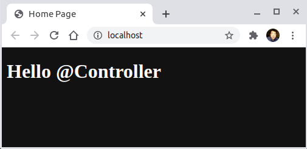

<a href = "https://kotlinlang.org/">

</a>


[](https://ubuntu.com/)
[](https://github.com/shyiko/jabba)
[](https://gradle.org/)
[](https://www.azul.com/downloads/zulu-community/?package=jdk)
[](https://github.com/JetBrains/kotlin)
[](https://www.jetbrains.com/idea/download/#section=linux)
[](https://www.docker.com/)
[](https://app.circleci.com/pipelines/github/cnruby/gradle_kotlin?branch=basic_206)


---

Unit 206: Hello @Controller!
<h1>Unit 206: Hello @Controller!</h1>

- How to Understand the Annotation `@Controller`
- How to Understand the Web Page Template `Thymeleaf`

---


<h1>Table of Contents</h1>

- [Keywords](#keywords)
- [Prerequisites](#prerequisites)
- [Create A New Kotlin Web App By Command Line](#create-a-new-kotlin-web-app-by-command-line)
  - [DO (create a new project)](#do-create-a-new-project)
  - [DO (edit the spring property file)](#do-edit-the-spring-property-file)
  - [DO (check the project)](#do-check-the-project)
- [Develop The Kotlin Web Application](#develop-the-kotlin-web-application)
  - [DO (create and edit a new spring controller file)](#do-create-and-edit-a-new-spring-controller-file)
  - [DO (create and edit the web page file)](#do-create-and-edit-the-web-page-file)
  - [DO (check the project)](#do-check-the-project-1)
- [Run The Web Application on Project](#run-the-web-application-on-project)
  - [DO (run The Web Application with Gradle)](#do-run-the-web-application-with-gradle)
  - [DO (open a new terminal to browse the website)](#do-open-a-new-terminal-to-browse-the-website)
- [Run The Web Application on Docker](#run-the-web-application-on-docker)
  - [DO (build an OCI image of the application)](#do-build-an-oci-image-of-the-application)
  - [DO (run the application on Docker)](#do-run-the-application-on-docker)
  - [DO (browse the web application on Docker)](#do-browse-the-web-application-on-docker)
- [References](#references)
- [References for tools](#references-for-tools)


## Keywords
- Annotation `@Controller` Kotlin Web Application Thymeleaf Template Web Page
- `Java JDK` `Command Line Kotlin Compiler` `IntelliJ CE` CircleCI CI
- tutorial example Kotlin REPL Ubuntu Gradle jabba JDK Java JVM


## Prerequisites
- [install JDK on Ubuntu 20.04](https://github.com/cnruby/gradle_java/blob/basic_101/README.md)
- [install Gradle on Ubuntu 20.04](https://github.com/cnruby/gradle_java/blob/basic_102/README.md)
- install `git`, `wget` and `curl` on Ubuntu 20.04
- install [jabba](https://github.com/shyiko/jabba) and Java JDK [Hello jabba!](https://github.com/cnruby/gradle_java/tree/basic_101)
- [install Command Line Kotlin Compiler (REPL)](https://kotlinlang.org/docs/tutorials/command-line.html) 
- [install IntelliJ CE / IntelliJ IDEA Community Edition](https://www.jetbrains.com/idea/download/#section=linux)


## Create A New Kotlin Web App By Command Line

### DO (create a new project)
```bash
NEW_APP_ID=206 && \
mkdir ${NEW_APP_ID}_gradle_kotlin && \
cd ${NEW_APP_ID}_gradle_kotlin && \
curl https://start.spring.io/starter.zip -d language=kotlin \
    -d dependencies=web,devtools,thymeleaf \
    -d packageName=de.iotoi \
    -d groupId=de.iotoi \
    -d artifactId=_gradle_kotlin \
    -d name=kotlin -d type=gradle-project -o basic_${NEW_APP_ID}.zip && \
unzip basic_${NEW_APP_ID}.zip
```

### DO (edit the spring property file)
```bash
touch ./src/main/resources/application.properties
```
```bash
nano ./src/main/resources/application.properties
```
```bash
# FILE (application.properties)
spring.main.banner-mode=off
spring.main.log-startup-info=off
web.app.name=Hello @Service
logging.level.root=WARN
```

### DO (check the project)
```bash
./gradlew -q check
```
```bash
    # >> Result: nothing
```


## Develop The Kotlin Web Application

### DO (create and edit a new spring controller file)
```bash
touch ./src/main/kotlin/de/iotoi/HelloHtmlController.kt
```
```bash
nano ./src/main/kotlin/de/iotoi/HelloHtmlController.kt
```
```kotlin
// FILE (HelloHtmlController.kt)
package de.iotoi

import org.springframework.beans.factory.annotation.Value
import org.springframework.stereotype.Controller
import org.springframework.ui.Model
import org.springframework.ui.set
import org.springframework.web.bind.annotation.GetMapping

@Controller
class HelloHtmlController {
    @Value("\${web.app.name}")
    val webAppName: String? = null

    @GetMapping("/")
    fun homePage(model: Model): String {
        model["webAppName"] = "$webAppName"
        return "home"
    }
}
```

### DO (create and edit the web page file)
```bash
touch ./src/main/resources/templates/home.html
```
```bash
nano ./src/main/resources/templates/home.html
```
```html
<!-- FILE (home.html) -->
<!DOCTYPE html>
<html lang="en" xmlns:th="http://www.w3.org/1999/xhtml">
    <head>
        <meta charset="UTF-8">
        <title>Home Page</title>
    </head>
    <body>
        <h1><span th:text="${webAppName}">...</span></h1>
    </body>
</html>
```

### DO (check the project)
```bash
./gradlew -q check
```
```bash
    # >> Result: nothing
```


## Run The Web Application on Project

### DO (run The Web Application with Gradle)
```bash
./gradlew -q bootRun
```
```bash
    # Result
    <==========---> 83% EXECUTING [21s]
    > :bootRun
```

### DO (open a new terminal to browse the website)
```bash
curl http://localhost:8080/
```
```bash
    # >> Result
    <!DOCTYPE html>
    <html lang="en">
      <head>
          <meta charset="UTF-8">
          <title>Home Page</title>
      </head>
      <body>
          <h1><span>Hello @Controller</span></h1>
      </body>
    </html>
```


## Run The Web Application on Docker

### DO (build an OCI image of the application)
```bash
./gradlew -q bootBuildImage --imageName=gradle_kotlin/basic_206
```
```bash
    # >> Result
    > Task :bootBuildImage
    Building image 'docker.io/gradle_kotlin/basic_206:latest'

     > Pulling builder image 'docker.io/paketobuildpacks/builder:base' ..................................................
     ...
     ...
        [creator]           docker.io/gradle_kotlin/basic_206:latest

    Successfully built image 'docker.io/gradle_kotlin/basic_206:latest'

    BUILD SUCCESSFUL in 3m 3s
    5 actionable tasks: 3 executed, 2 up-to-date     
```

### DO (run the application on Docker)
```bash
docker run -p 80:8080 gradle_kotlin/basic_206
```
```bash
    # >> Result
    Setting Active Processor Count to 4
    Calculating JVM memory based on 5024188K available memory
    Calculated JVM Memory Configuration: -XX:MaxDirectMemorySize=10M -Xmx4422855K -XX:MaxMetaspaceSize=89332K -XX:ReservedCodeCacheSize=240M -Xss1M (Total Memory: 5024188K, Thread Count: 250, Loaded Class Count: 13358, Headroom: 0%)
    Adding 138 container CA certificates to JVM truststore
    Spring Cloud Bindings Enabled
    Picked up JAVA_TOOL_OPTIONS: -Djava.security.properties=/layers/paketo-buildpacks_bellsoft-liberica/java-security-properties/java-security.properties -agentpath:/layers/paketo-buildpacks_bellsoft-liberica/jvmkill/jvmkill-1.16.0-RELEASE.so=printHeapHistogram=1 -XX:ActiveProcessorCount=4 -XX:MaxDirectMemorySize=10M -Xmx4422855K -XX:MaxMetaspaceSize=89332K -XX:ReservedCodeCacheSize=240M -Xss1M -Dorg.springframework.cloud.bindings.boot.enable=true
```

### DO (browse the web application on Docker)
```bash
google-chrome http://localhost:80/
```



## References
- https://www.thymeleaf.org/
- https://www.jetbrains.com/help/idea/thymeleaf.html#Thymeleaf-7-chapter
- https://www.codeflow.site/de/article/thymeleaf-in-spring-mvc
- https://www.mdeditor.tw/pl/pKJo


## References for tools
- [Add a copy to clipboard button in a GitHub](https://github.com/zenorocha/codecopy#install)
